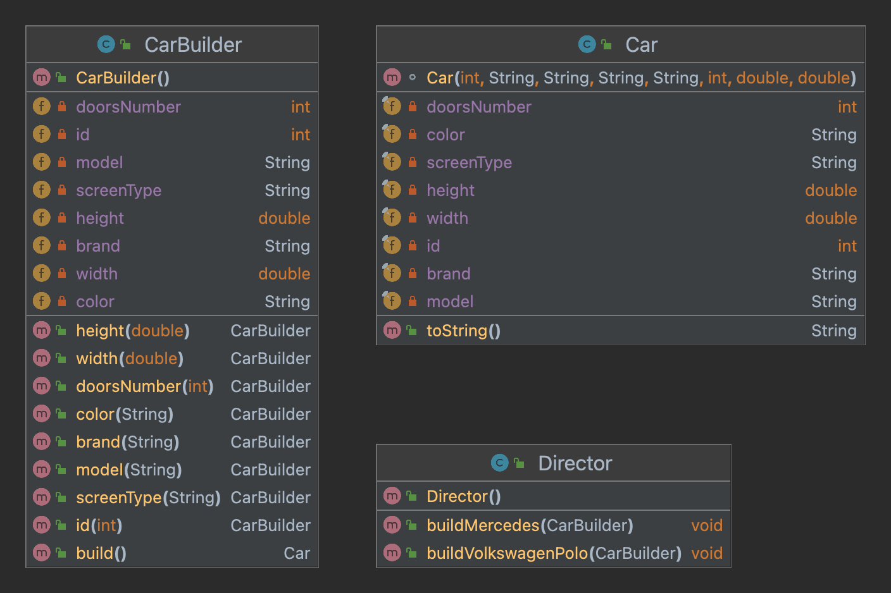

# Builder Pattern

Builder is a creational design pattern that lets you construct complex objects step by step. The pattern allows you to produce different types and representations of an object using the same construction code.




## Director 
```optional```

**Director** defines the order in which we should call the construction steps, 
so that we can reuse specific configurations of the product 
we are building
It is hide the details of the product construction from the client code.
