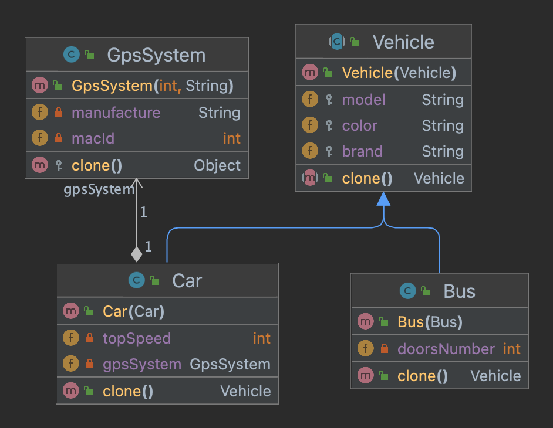

# Prototype Pattern

Prototype pattern is a creational design pattern that delegates object cloning or duplicating
process to the actual objects that are being cloned. 

The prototype pattern is useful when you want to create new objects that are similar to existing objects, but you do not want to specify the exact steps that were used to create the existing objects. It allows you to create new objects by copying existing objects, rather than creating new objects from scratch.

its good practice to create prototype register to create some predefined prototypes to clone it latter.

use prototype pattern when your code shouldn't depend on the concrete 
classes of the objects that you need to copy or duplicate.
